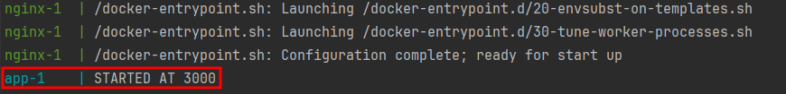

## Sobre o projeto

Projeto funciona com uma aplicação `node.js` que gera nomes aleatórios e salva no banco
de dados **MySQL** a cada F5 no navegador e utiliza do nginx para fazer o proxy reverso
que direciona as requisições feitas da porta `8080` para a porta `3000` da aplicação node.

### Para subir o projeto

Basta você executar o comando: `docker-compose up -d` na raiz do projeto e ele
iniciará o build das imagens automaticamente.

* Temos o **_HealthCheck_** no container do `db`, para nos auxiliar e garantir que o banco
sempre suba primeiro do que os outros containers.

> Pode ser que demore alguns minutos para subir toda a aplicação, você pode acompanhar
> o log e assim que aparecer essa mensagem abaixo, está pronto:
> 